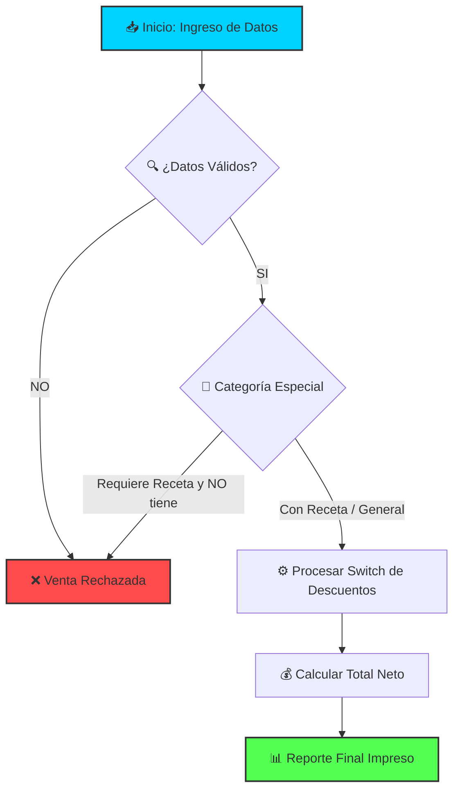

# prueba_practica_logica_grupoN2_Cordonez_Gomez_Garces_Zambrano
FARMACIA - PRUEBA PRACTICA
<div align="center">

# ⚡ EXAMEN PRÁCTICO DE SOFTWARE ⚡
## 🏥 SISTEMA PHARMASYS ACTIVADO 🏥
### ✨ UNIVERSIDAD TÉCNICA DE AMBATO ✨

<p align="center">
  
  
</p>

---

<!-- EFECTO DE MOVIMIENTO CONTINUO (MARQUEE) -->
<marquee scrollamount="6" behavior="scroll" direction="left">
  <b>🚀 INTEGRANTES DEL GRUPO: Cristian Gómez • Esteban Zambrano • Erick Cordonez • Kevin Garcés 🚀</b>
</marquee>

</div>

---

## 📂 1. Estructura Dinámica del Repositorio

> 💡 *Haz clic abajo para desplegar el mapa interactivo del proyecto.*

<details>
<summary><b>📂 Ver Organización del Proyecto (Clic aquí)</b></summary>
<br>

```text
📁 prueba-practica-logica/
├── 📁 ejercicio-2/          → Código Fuente Ejercicio2.java (PharmaSys)
├── 📁 evidencia-manual/     → Escaneos (Análisis, Pseudocódigo, Escritorio)
└── 📁 capturas-ejecucion/   → Evidencias de Ejecución en VS Code
```
</details>

---

## 🏥 2. Ejercicio 2 – PharmaSys: Farmacia

### 📊 Flujo Metodológico Integrado



<details>
<summary><b>💻 VER CÓDIGO FUENTE OPTIMIZADO (Clic aquí)</b></summary>
<br>

```java
package ejercicio_2;

import java.util.Scanner;

public class Ejercicio2 {
    public static void main(String[] args) {
        Scanner scanner = new Scanner(System.in);
        
        // Definición de variables idénticas al pseudocódigo
        int nVentas, opCategoria, cantidad;
        double precio, subtotal, descuentoCantidad, valorDescuento, totalPagar;
        double totalVendidoGeneral = 0.0;
        double totalDescontadoGeneral = 0.0;
        int ventasRechazadas = 0;
        String codigo, nombre, categoria;
        char requiereReceta;
        double porcentajeDescCat;
        
        // Validación del número de ventas
        System.out.print("Ingrese el número de ventas a procesar: ");
        nVentas = scanner.nextInt();
        while (nVentas <= 0) {
            System.out.print("Error. Ingrese un valor mayor a 0: ");
            nVentas = scanner.nextInt();
        }
        
        // Ciclo principal
        for (int i = 1; i <= nVentas; i++) {
            System.out.println("--- Venta " + i + " ---");
            scanner.nextLine(); // Limpiar búfer
            
            System.out.print("Ingrese código: ");
            codigo = scanner.nextLine();
            
            System.out.print("Ingrese nombre: ");
            nombre = scanner.nextLine();
            
            // Validación de precio > 0
            do {
                System.out.print("Ingrese precio unitario: ");
                precio = scanner.nextDouble();
            } while (precio <= 0);
            
            System.out.print("Seleccione categoría (1: Genérico, 2: Comercial, 3: Especializado): ");
            opCategoria = scanner.nextInt();
            
            // Estructura Según (Switch en Java)
            switch (opCategoria) {
                case 1:
                    categoria = "Genérico";
                    porcentajeDescCat = 0.05;
                    break;
                case 2:
                    categoria = "Comercial";
                    porcentajeDescCat = 0.10;
                    break;
                case 3:
                    categoria = "Especializado";
                    porcentajeDescCat = 0.15;
                    break;
                default:
                    categoria = "Desconocido";
                    porcentajeDescCat = 0.0;
                    break;
            }
            
            // Validación de cantidad > 0
            do {
                System.out.print("Ingrese cantidad: ");
                cantidad = scanner.nextInt();
            } while (cantidad <= 0);
            
            System.out.print("¿Requiere receta médica? (s/n): ");
            requiereReceta = scanner.next().toLowerCase().charAt(0);
            
            // Lógica de rechazo por receta médica
            if (categoria.equals("Especializado") && requiereReceta == 'n') {
                System.out.println("VENTA RECHAZADA: Requiere receta.");
                ventasRechazadas = ventasRechazadas + 1;
            } else {
                subtotal = precio * cantidad;
                
                // Descuento por rangos de cantidad
                if (cantidad >= 10 && cantidad < 20) {
                    descuentoCantidad = 0.05;
                } else {
                    if (cantidad >= 20) {
                        descuentoCantidad = 0.10;
                    } else {
                        descuentoCantidad = 0.0;
                    }
                }
                
                // Cálculos finales de la venta
                valorDescuento = subtotal * (porcentajeDescCat + descuentoCantidad);
                totalPagar = subtotal - valorDescuento;
                
                totalVendidoGeneral = totalVendidoGeneral + totalPagar;
                totalDescontadoGeneral = totalDescontadoGeneral + valorDescuento;
                
                System.out.printf("Total a pagar: $%.2f\n", totalPagar);
            }
        }
        
        // Resumen final impreso en consola
        System.out.println("=== RESUMEN FINAL ===");
        System.out.printf("Total Vendido: $%.2f\n", totalVendidoGeneral);
        System.out.printf("Total Descontado: $%.2f\n", totalDescontadoGeneral);
        System.out.println("Ventas Rechazadas: " + ventasRechazadas);
        
        scanner.close();
    }
}
```
</details>

---

## ⚡ 3. Tecnologías Empleadas

| Stack | Nivel de Implementación | Barra de Carga |
| :--- | :--- | :--- |
| **Java SE 17** | Avanzado / Estructuras de Control | `██████████████████▒ 90%` |
| **Markdown** | Interfaz Visual Interactiva | `████████████████████ 100%` |
| **VS Code** | Entorno de Compilación Oficial | `██████████████████▒ 95%` |

---

<div align="center">

### ✨ Entregable desarrollado con éxito por el equipo. ✨
*Haga clic en la estrella (Star) del repositorio si el resultado fue satisfactorio.*

</div>


