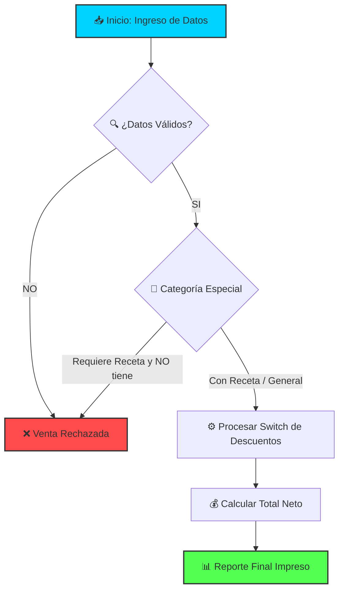

# prueba_practica_logica_grupoN2_Cordonez_Gomez_Garces_Zambrano
FARMACIA - PRUEBA PRACTICA
<div align="center">

# ⚡ EXAMEN PRÁCTICO DE SOFTWARE ⚡
## 🏥 SISTEMA PHARMASYS ACTIVADO 🏥
### ✨ UNIVERSIDAD TÉCNICA DE AMBATO ✨

<p align="center">
  
  
</p>

---

<!-- EFECTO DE MOVIMIENTO CONTINUO (MARQUEE) -->
<marquee scrollamount="6" behavior="scroll" direction="left">
  <b>🚀 INTEGRANTES DEL GRUPO: Cristian Gómez • Esteban Zambrano • Erick Cordonez • Kevin Garcés 🚀</b>
</marquee>

</div>

---

## 📂 1. Estructura Dinámica del Repositorio

> 💡 *Haz clic abajo para desplegar el mapa interactivo del proyecto.*

<details>
<summary><b>📂 Ver Organización del Proyecto (Clic aquí)</b></summary>
<br>

```text
📁 prueba-practica-logica/
├── 📁 ejercicio-2/          → Código Fuente Ejercicio2.java (PharmaSys)
├── 📁 evidencia-manual/     → Escaneos (Análisis, Pseudocódigo, Escritorio)
└── 📁 capturas-ejecucion/   → Evidencias de Ejecución en VS Code
```
</details>

---

## 🏥 2. Ejercicio 2 – PharmaSys: Farmacia

### 📊 Flujo Metodológico Integrado



<details>
<summary><b>💻 VER CÓDIGO FUENTE OPTIMIZADO (Clic aquí)</b></summary>
<br>

```java
import java.util.Scanner;

public class Ejercicio2 {
    public static void main(String[] args) {
        Scanner scanner = new Scanner(System.in);
        
        double totalVendido = 0.0;
        double totalDescontado = 0.0;
        int ventasRechazadas = 0;
        
        System.out.println("=================================================");
        System.out.println("🏥   SISTEMA DE GESTIÓN DE FARMACIA - PHARMASYS   🏥");
        System.out.println("=================================================");
        
        System.out.print("Ingrese la cantidad de ventas a procesar (N): ");
        int n = scanner.nextInt();
        
        int contador = 0;
        while (contador < n) {
            System.out.println("\n-------------------------------------------------");
            System.out.println("📝 REGISTRO DE VENTA #" + (contador + 1) + " DE " + n);
            System.out.println("-------------------------------------------------");
            scanner.nextLine(); 
            
            System.out.print("Nombre del producto: ");
            String nombre = scanner.nextLine();
            
            System.out.print("Precio del producto ($): ");
            double precio = scanner.nextDouble();
            
            System.out.print("Categoría (1 = Genérico, 2 = Comercial, 3 = Especializado): ");
            int categoria = scanner.nextInt();
            
            System.out.print("Cantidad a comprar: ");
            int cantidad = scanner.nextInt();
            
            System.out.print("¿Requiere/presenta receta médica? (S/N): ");
            char receta = scanner.next().toUpperCase().charAt(0);
            
            if (precio <= 0 || cantidad <= 0 || (categoria < 1 || categoria > 3)) {
                System.out.println("❌ VENTA RECHAZADA: Datos inválidos.");
                ventasRechazadas++;
                contador++;
                continue;
            }
            
            if (categoria == 3 && receta != 'S') {
                System.out.println("❌ VENTA RECHAZADA: Requiere receta obligatoria.");
                ventasRechazadas++;
                contador++;
                continue;
            }
            
            double subtotal = precio * cantidad;
            double porcentajeDescuento = 0.0;
            
            switch (categoria) {
                case 1:
                    porcentajeDescuento = 0.05;
                    break;
                case 2:
                    porcentajeDescuento = 0.10;
                    break;
                case 3:
                    porcentajeDescuento = 0.15;
                    break;
            }
            
            double descuentoCantidad = 0.0;
            if (cantidad >= 10 && cantidad < 20) {
                descuentoCantidad = 0.05;
            } else if (cantidad >= 20) {
                descuentoCantidad = 0.10;
            }
            
            double porcentajeTotal = porcentajeDescuento + descuentoCantidad;
            double descuentoCalculado = subtotal * porcentajeTotal;
            double totalPagar = subtotal - descuentoCalculado;
            
            totalVendido += totalPagar;
            totalDescontado += descuentoCalculado;
            
            System.out.println("✅ Venta procesada con éxito.");
            System.out.printf("   Total a pagar: $%.2f\n", totalPagar);
            
            contador++;
        }
        
        System.out.println("\n=================================================");
        System.out.println("📊        REPORTE FINAL GENERAL DE VENTAS        📊");
        System.out.println("=================================================");
        System.out.printf("💰 Total Neto Vendido:           $%.2f\n", totalVendido);
        System.out.printf("📉 Total Monto Descontado:       $%.2f\n", totalDescontado);
        System.out.println("❌ Cantidad de Ventas Rechazadas: " + ventasRechazadas);
        System.out.println("=================================================");
        
        scanner.close();
    }
}
```
</details>

---

## ⚡ 3. Tecnologías Empleadas

| Stack | Nivel de Implementación | Barra de Carga |
| :--- | :--- | :--- |
| **Java SE 17** | Avanzado / Estructuras de Control | `██████████████████▒ 90%` |
| **Markdown** | Interfaz Visual Interactiva | `████████████████████ 100%` |
| **VS Code** | Entorno de Compilación Oficial | `██████████████████▒ 95%` |

---

<div align="center">

### ✨ Entregable desarrollado con éxito por el equipo. ✨
*Haga clic en la estrella (Star) del repositorio si el resultado fue satisfactorio.*

</div>


